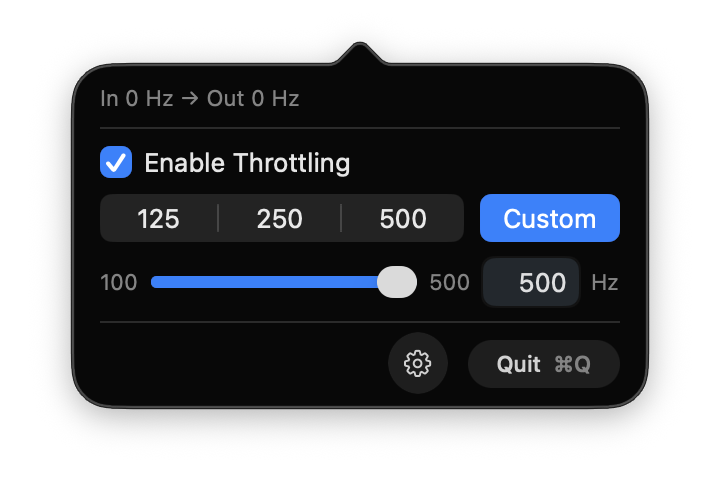
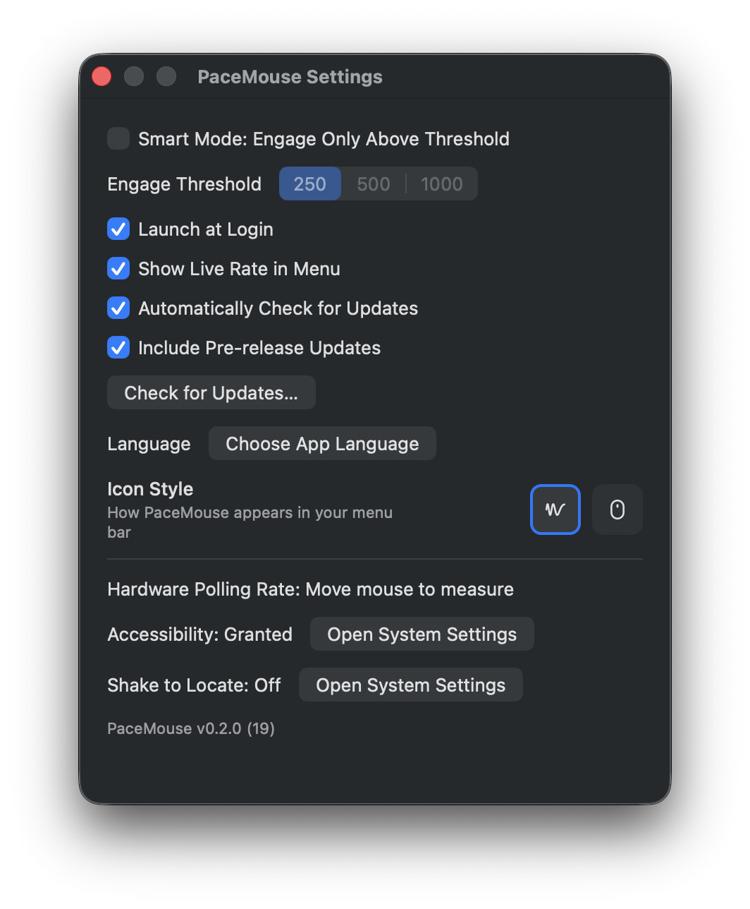

  

<h1 align="center">PaceMouse</h1>

  <strong>English</strong>
  &nbsp;·&nbsp;
  <a href="README.zh-Hans.md">中文</a>

  
  

A macOS menu bar app that throttles high-polling-rate mouse **move and drag** events to reduce stutter.

macOS does not support high mouse polling rates (>500 Hz) well. If you use the same mouse across several machines (Windows / Linux / macOS), PaceMouse can throttle move and drag events before they reach the system; clicks and scrolling are unaffected.

## Install

1. Download the DMG from [Releases](https://github.com/ChuwuYo/PaceMouse/releases)
2. Open it and drag PaceMouse into Applications
3. If macOS blocks the first launch: **System Settings → Privacy & Security → Open Anyway** (or right-click → Open)
4. Grant **Accessibility** access when asked

## Screenshots

   
  <em>Menu</em>

   
  <em>Settings</em>

## Usage

- Turn throttling on or off from the menu bar icon
- Target rate: **125 / 250 / 500 Hz** (250 recommended by default), or a custom integer from **100–500 Hz**
- Optional **Smart Mode**: throttle only when the measured input rate exceeds a threshold
- While running, the menu shows live `In → Out` Hz

PaceMouse does **not** change USB polling rate, acceleration curve, buttons, or scrolling. For those, see [LinearMouse](https://github.com/linearmouse/linearmouse) or [Mac Mouse Fix](https://github.com/noah-nuebling/mac-mouse-fix).

## How it works

macOS has no public API to lower a device’s negotiated USB report rate. PaceMouse uses a `CGEventTap` at `.cghidEventTap` to accumulate motion deltas and release them at your target rate (token bucket). Non-motion events bypass that path.

## References

- [Karabiner-Elements](https://github.com/pqrs-org/Karabiner-Elements) — event tap lifecycle and permissions
- [LinearMouse](https://github.com/linearmouse/linearmouse) — macOS mouse utility architecture
- [Mac Mouse Fix](https://github.com/noah-nuebling/mac-mouse-fix) — high-rate mouse event handling
- [EventTapper](https://github.com/usagimaru/EventTapper) — small Swift wrapper around `CGEventTap`
- [pollingrate](https://github.com/84ix/pollingrate) — measuring mouse polling rate on macOS

## License

[GPL-3.0](LICENSE)
