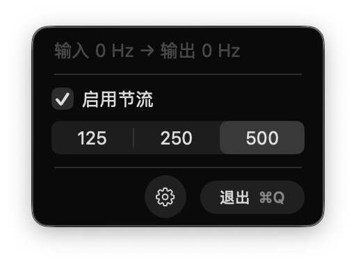
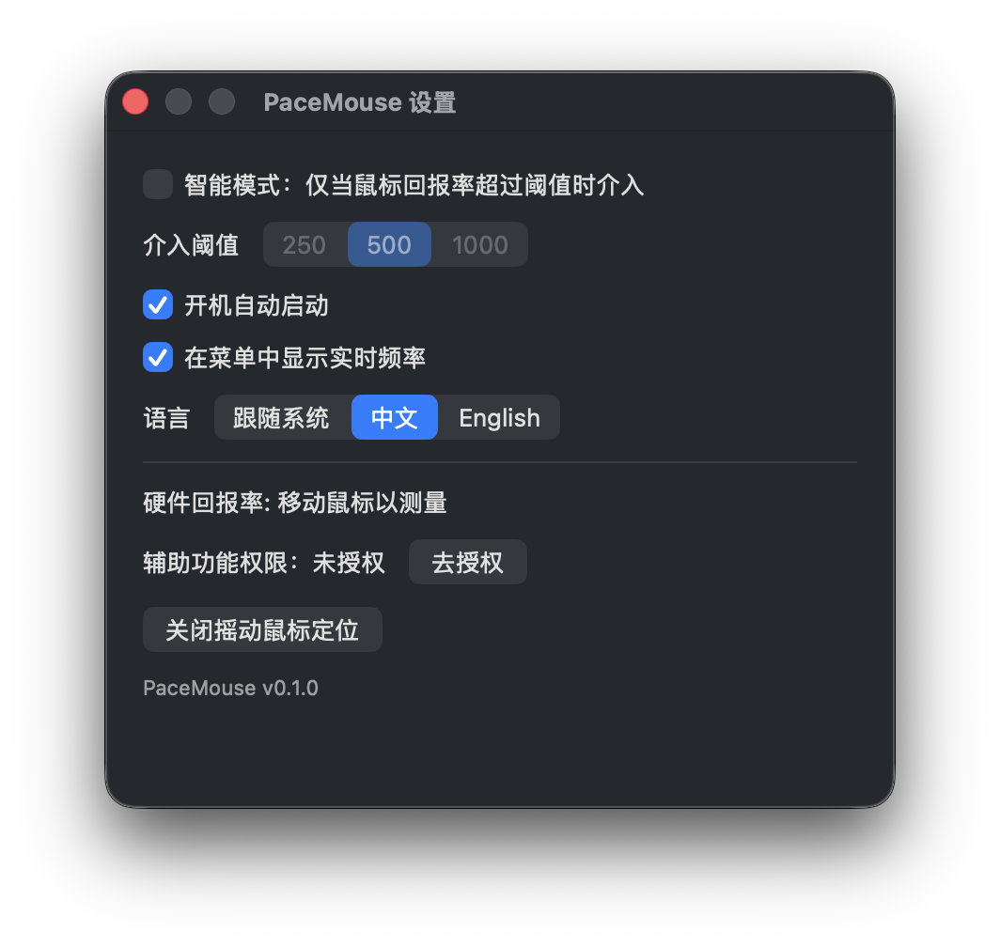

  

# PaceMouse

  <a href="README.md">English</a> · <a href="README.zh-Hans.md">中文</a>

macOS 菜单栏工具：把高回报率鼠标的 **移动 / 拖拽** 事件节流掉，减轻卡顿。

macOS 目前对高回报率（>500 Hz）支持不佳。若同一只鼠标在多台设备间切换（Windows / Linux / macOS），可用 PaceMouse 在事件进入系统分发前降低移动事件频率；点击和滚动原样放行。

## 安装

1. 从 [Releases](https://github.com/ChuwuYo/PaceMouse/releases) 下载 DMG 安装包
2. 打开后把 PaceMouse 拖进「应用程序」
3. 首次打开：右键 → **打开**（自签名开发构建，Gatekeeper 会提示一次）
4. 按提示授予**辅助功能**权限

## 截图

   
  

## 使用

- 点菜单栏图标开关节流
- 目标频率：**125 / 250 / 500 Hz**（一般用 250）
- 可选**智能模式**：只有实测输入超过阈值时才介入
- 运行时可在菜单里看 `输入 → 输出` Hz

PaceMouse **不会**改 USB 回报率、加速曲线、按键或滚轮。那些需求请用 [LinearMouse](https://github.com/linearmouse/linearmouse)、[Mac Mouse Fix](https://github.com/noah-nuebling/mac-mouse-fix) 一类工具。

## 原理

macOS 没有公开 API 去改设备协商好的 USB 回报率。PaceMouse 在 `.cghidEventTap` 上挂 `CGEventTap`，把移动增量累加后按目标频率（令牌桶）放行；非移动事件不进这条路径。

## 参考

- [Karabiner-Elements](https://github.com/pqrs-org/Karabiner-Elements) — 事件 tap 生命周期 / 权限
- [LinearMouse](https://github.com/linearmouse/linearmouse) — macOS 鼠标工具架构
- [Mac Mouse Fix](https://github.com/noah-nuebling/mac-mouse-fix) — 高回报率下的事件处理
- [EventTapper](https://github.com/usagimaru/EventTapper) — CGEventTap 的小型 Swift 封装
- [pollingrate](https://github.com/84ix/pollingrate) — macOS 鼠标回报率测量
- [razer-mouse-lite-macos](https://github.com/NZKea/razer-mouse-lite-macos) — 菜单栏形态参考

## 许可

[GPL-3.0](LICENSE)
